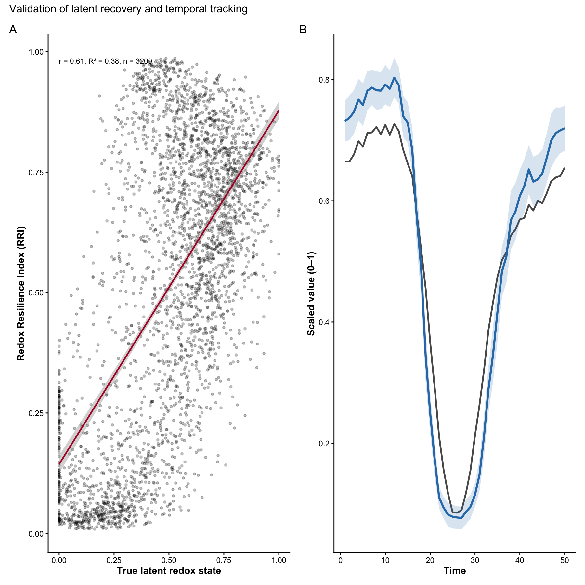
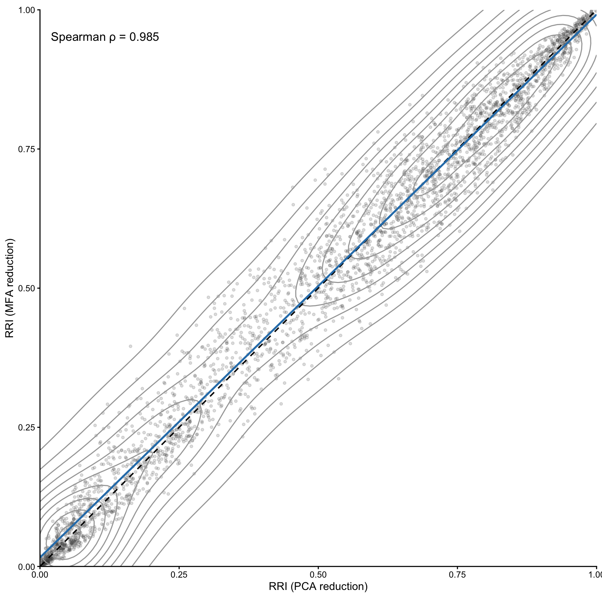
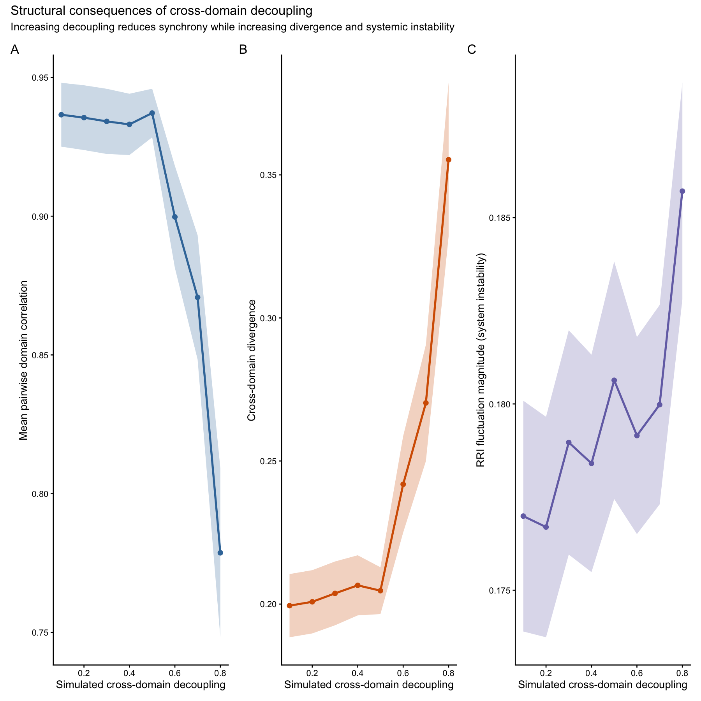
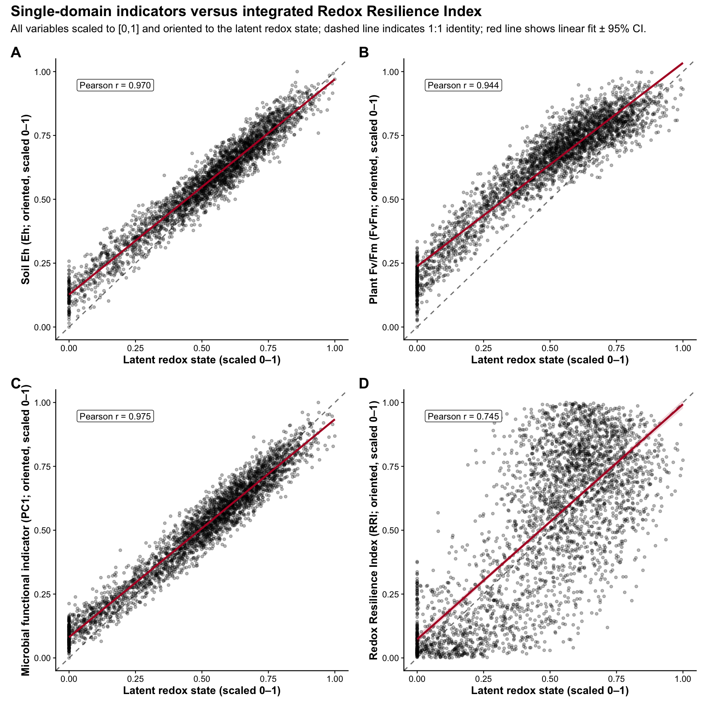
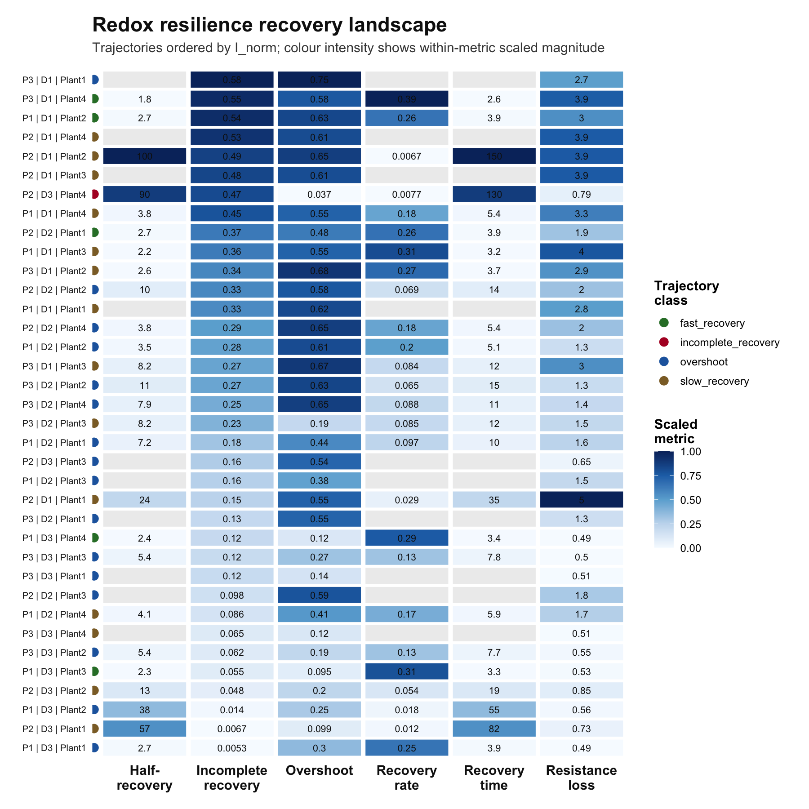

# RRI

``` r

library(RRI)
```

### Overview

RedoxRRI formalises holobiont resilience as coordinated redox buffering
across plant, soil, and microbial compartments. Rather than analysing
each domain independently, the framework models resilience as an
emergent, cross-domain property that can be expressed either as a scalar
index (RRI) or as a compositional allocation in simplex space.

RedoxRRI provides a transparent and extensible framework to quantify
holobiont redox resilience by integrating three complementary domains:

- Plant physiology (oxidative / nitrosative buffering and stress traits)
- Soil redox stability (Eh and redox-coupled chemistry)
- Microbial resilience

Microbial resilience, represented as a single blended domain that can
incorporate: microbial abundance or functional composition (micro_data)
microbial network organization (igraph network metrics) The primary
output of the package is: a per-sample Redox Resilience Index (RRI)
scaled to \[0,1\]) a ternary-ready compositional representation (Physio,
Soil, Micro) with row sums equal to 1

an optional system-level index stored as attr(x, “RRI_index”)

The
[`simulate_redox_holobiont()`](https://mghotbi.github.io/RRI/reference/simulate_redox_holobiont.md)
can create a rich synthetic benchmark dataset with plant, soil,
microbial, trait, and optional gene-level layers. This richness is
useful for demonstration, testing, and method development, but users do
**not** need to measure every variable generated by the simulator.

RedoxRRI is designed to work with both:

1.  simulated benchmark data generated inside the package, and  
2.  user-supplied external datasets from field, greenhouse, mesocosm, or
    laboratory experiments.

The key requirement is not that every simulated variable is present. The
key requirement is that the input tables are **row-aligned**, meaning
that row `i` in each domain table refers to the same biological sample
as row `i` in `id`.

At minimum, users should provide:

- `id`: sample metadata, including time and grouping variables if
  needed;
- `ROS_flux`: one or more plant or physiological variables;
- `Eh_stability`: one or more soil redox or soil chemistry variables;
- `micro_data`: one or more microbial abundance, functional, trait, or
  molecular variables.

### Conceptual model

#### Domain-level aggregation implemented in `rri_pipeline_st()`

Each domain (Physiology, Soil, and Microbial) is first summarized into a
one-dimensional latent score per sample using a user-selected method
(e.g., PCA, FA, UMAP, or WGCNA). These latent scores are then scaled to
the range \[0, 1\].

The Redox Resilience Index (RRI) is computed as a weighted linear
combination of the scaled domain scores. The domain weights are
user-defined and must sum to one. Higher RRI values indicate samples
with stronger physiological buffering, greater soil redox stability, and
higher microbial resilience relative to other samples in the same
dataset.

Optional coupling terms can be included to capture coherence among
domains, allowing the index to reflect not only domain magnitudes but
also their agreement or joint stability.

### Microbial domain as a blended score

To preserve a three-part (Physiology-Soil-Microbial) ternary
representation, microbial resilience is modeled as a single blended
domain score.

When both microbial abundance (or functional composition) data and
microbial network data are available, the microbial domain score is
computed as a weighted blend of the two components. The parameter
`alpha_micro` controls their relative contribution:

- `alpha_micro = 1`: abundance or functional composition only  
- `alpha_micro = 0`: network structure only  
- `alpha_micro = 0.5`: equal contribution (default)

This design allows flexible emphasis on microbial composition, microbial
function, or both. Functional information can include gene abundance,
functional gene coverage, metagenomic features, metatranscriptomic
expression, or gene upregulation summaries. These inputs are integrated
into a single microbial resilience domain while maintaining a consistent
three-domain representation suitable for compositional and ternary
visualization.

For example, users may include variables such as:

- taxonomic abundance features, such as ASVs, OTUs, MAGs, or taxa;
- microbial trait scores;
- functional gene abundance, such as `narG`, `nirK`, `nosZ`, `mtrA`,
  `dsrA`, or `mcrA`;
- metatranscriptomic expression values;
- log2 fold-change or upregulation scores;
- pathway-level or guild-level summaries;
- redox process indicators, such as denitrification, sulfate reduction,
  methanogenesis, extracellular electron transfer, or ROS detoxification
  scores.

These features can be combined into one microbial feature table before
running
[`rri_pipeline_st()`](https://mghotbi.github.io/RRI/reference/rri_pipeline_st.md):

### Simulated example data

All data used in this vignette are fully simulated and are provided
solely for demonstration and testing purposes.

generated using simulate_redox_holobiont() and mimics

qualitative properties of redox-ecological systems, including:
correlated plant physiological traits soil redox gradients and stability
microbial functional heterogeneity spatial grouping and temporal
structure The simulation does not represent any real experiment,
species, site, or ecosystem.

### Reproducibility

All analyses in this vignette are fully reproducible and rely only on
simulated data generated within the package.

``` r

library(dplyr)
```

    ## Warning: package 'dplyr' was built under R version 4.5.2

    ## 
    ## Attaching package: 'dplyr'

    ## The following objects are masked from 'package:stats':
    ## 
    ##     filter, lag

    ## The following objects are masked from 'package:base':
    ## 
    ##     intersect, setdiff, setequal, union

``` r

library(tibble)
```

    ## Warning: package 'tibble' was built under R version 4.5.2

``` r

if (!requireNamespace("patchwork", quietly = TRUE)) {
  message("Optional package 'patchwork' not installed.")
}

# Reproducible simulation
set.seed(1342)

sim <- simulate_redox_holobiont(
  n_plot = 4,
  n_depth = 2,
  n_plant = 4,
  n_time = 12,
  p_micro = 80,
  p_gene = 36,
  gene_mode = "both",
  disturbance_strength = 0.5,
  decoupling = 0.3,
  stochastic_reassembly = TRUE
)

# Inspect object structure
str(sim, max.level = 1)
```

    ## List of 10
    ##  $ id             :'data.frame': 384 obs. of  4 variables:
    ##  $ ROS_flux       :'data.frame': 384 obs. of  14 variables:
    ##  $ Eh_stability   :'data.frame': 384 obs. of  18 variables:
    ##  $ micro_data     :'data.frame': 384 obs. of  80 variables:
    ##  $ micro_traits   :'data.frame': 384 obs. of  15 variables:
    ##  $ gene_abundance :'data.frame': 384 obs. of  36 variables:
    ##  $ gene_expression:'data.frame': 384 obs. of  36 variables:
    ##  $ gene_log2fc    :'data.frame': 384 obs. of  36 variables:
    ##  $ latent_truth   : num [1:384] 0.733 0.832 0.877 0.701 0.472 ...
    ##  $ graph          : NULL

``` r

# Available simulated components
names(sim)
```

    ##  [1] "id"              "ROS_flux"        "Eh_stability"    "micro_data"     
    ##  [5] "micro_traits"    "gene_abundance"  "gene_expression" "gene_log2fc"    
    ##  [9] "latent_truth"    "graph"

``` r

# Experimental design
utils::head(sim$id)
```

    ##   plot depth plant_id time
    ## 1   P1    D1   Plant1    1
    ## 2   P2    D1   Plant1    1
    ## 3   P3    D1   Plant1    1
    ## 4   P4    D1   Plant1    1
    ## 5   P1    D2   Plant1    1
    ## 6   P2    D2   Plant1    1

``` r

# Plant physiology variables
names(sim$ROS_flux)
```

    ##  [1] "SPAD"                   "FvFm"                   "PhiPSII"               
    ##  [4] "NPQ"                    "ROL"                    "root_exudates"         
    ##  [7] "organic_acids"          "phenolics"              "exudate_redox_activity"
    ## [10] "aerenchyma"             "ROL_barrier"            "root_oxidative_stress" 
    ## [13] "root_redox_buffering"   "Fe_plaque_proxy"

``` r

# Soil redox variables
names(sim$Eh_stability)
```

    ##  [1] "Eh"                             "pH"                            
    ##  [3] "water_content"                  "air_filled_porosity"           
    ##  [5] "pore_connectivity"              "aqueous_connectivity"          
    ##  [7] "oxygen_availability"            "DOC"                           
    ##  [9] "dissolved_organic_matter_redox" "EAC"                           
    ## [11] "EDC"                            "redox_buffer_capacity"         
    ## [13] "Fe2.Fe3"                        "Mn2.Mn4"                       
    ## [15] "NH4.NO3"                        "sulfide_risk"                  
    ## [17] "methane_potential"              "nitrate_reduction_potential"

``` r

# Microbial abundance matrix
dim(sim$micro_data)
```

    ## [1] 384  80

``` r

# Functional microbial traits
names(sim$micro_traits)
```

    ##  [1] "aerobic_respiration"         "denitrification"            
    ##  [3] "Fe_Mn_reduction"             "EET_potential"              
    ##  [5] "sulfate_reduction"           "methanogenesis"             
    ##  [7] "flavin_mediator"             "phenazine_mediator"         
    ##  [9] "quinone_humic_shuttle"       "microbial_ROS_detox"        
    ## [11] "AMF_connectivity"            "protist_grazing"            
    ## [13] "viral_lysis"                 "microbial_memory"           
    ## [15] "microbial_redox_flexibility"

``` r

# Optional functional gene abundance
if (!is.null(sim$gene_abundance)) {
  names(sim$gene_abundance)[1:10]
}
```

    ##  [1] "coxA_cov" "coxB_cov" "cyoA_cov" "cyoB_cov" "sodA_cov" "katG_cov"
    ##  [7] "narG_cov" "narH_cov" "napA_cov" "nirK_cov"

``` r

# Optional metatranscriptomic expression
if (!is.null(sim$gene_expression)) {
  names(sim$gene_expression)[1:10]
}
```

    ##  [1] "coxA_MetaT" "coxB_MetaT" "cyoA_MetaT" "cyoB_MetaT" "sodA_MetaT"
    ##  [6] "katG_MetaT" "narG_MetaT" "narH_MetaT" "napA_MetaT" "nirK_MetaT"

``` r

# Optional gene upregulation summaries
if (!is.null(sim$gene_log2fc)) {
  names(sim$gene_log2fc)[1:10]
}
```

    ##  [1] "coxA_log2FC" "coxB_log2FC" "cyoA_log2FC" "cyoB_log2FC" "sodA_log2FC"
    ##  [6] "katG_log2FC" "narG_log2FC" "narH_log2FC" "napA_log2FC" "nirK_log2FC"

The simulated object contains: ROS_flux: plant physiological traits
(samples × variables) Eh_stability: soil redox variables micro_data:
microbial functional features id: sample metadata (spatial and temporal
structure) graph (optional): an igraph network or list of networks

### Computing the Redox Resilience Index

Resistance = immediate deviation in redox potential after disturbance
Resilience = rate or magnitude of redox recovery

``` r

if (!requireNamespace("FactoMineR", quietly = TRUE)) {
  knitr::opts_chunk$set(eval = FALSE)
}
 
# At minimum, this can be only sim$micro_data.

micro_features <- sim$micro_data

res <- rri_pipeline_st(
  ROS_flux = sim$ROS_flux,
  Eh_stability = sim$Eh_stability,
  micro_data = micro_features,
  id = sim$id,
  reducer = "per_domain",
  scaling = "pnorm",
  direction_phys = "auto",
  direction_anchor_phys = "FvFm",
  direction_soil = "auto",
  direction_anchor_soil = "Eh",
  direction_micro = "higher_is_better"
)

utils::head(res$row_scores)
```

    ##      Physio      Soil     Micro       RRI Micro_abundance Micro_network
    ## 1 0.8699117 0.8845293 0.2398984 0.9114675       0.2398984            NA
    ## 2 0.9144952 0.9401114 0.2154539 0.9386268       0.2154539            NA
    ## 3 0.8731187 0.9374320 0.2022485 0.9213649       0.2022485            NA
    ## 4 0.7563769 0.9378121 0.2395087 0.8816193       0.2395087            NA
    ## 5 0.5007963 0.4907704 0.4374266 0.4540520       0.4374266            NA
    ## 6 0.5087094 0.4678307 0.3385583 0.3824589       0.3385583            NA
    ##   Micro_mfa
    ## 1        NA
    ## 2        NA
    ## 3        NA
    ## 4        NA
    ## 5        NA
    ## 6        NA

``` r

##or

micro_features_full <- sim$micro_data

if (!is.null(sim$micro_traits)) {
  micro_features_full <- cbind(micro_features_full, sim$micro_traits)
}

if (!is.null(sim$gene_abundance)) {
  micro_features_full <- cbind(micro_features_full, sim$gene_abundance)
}

if (!is.null(sim$gene_log2fc)) {
  micro_features_full <- cbind(micro_features_full, sim$gene_log2fc)
}

res <- rri_pipeline_st(
  ROS_flux = sim$ROS_flux,
  Eh_stability = sim$Eh_stability,
  micro_data = micro_features_full,
  id = sim$id,
  reducer = "per_domain",
  scaling = "pnorm",
  direction_phys = "auto",
  direction_anchor_phys = "FvFm",
  direction_soil = "auto",
  direction_anchor_soil = "Eh",
  direction_micro = "higher_is_better"
)

utils::head(res$row_scores)
```

    ##      Physio      Soil      Micro       RRI Micro_abundance Micro_network
    ## 1 0.8699117 0.8845293 0.20315229 0.9124499      0.20315229            NA
    ## 2 0.9144952 0.9401114 0.07339124 0.9174502      0.07339124            NA
    ## 3 0.8731187 0.9374320 0.11975166 0.9113360      0.11975166            NA
    ## 4 0.7563769 0.9378121 0.24088668 0.8927195      0.24088668            NA
    ## 5 0.5007963 0.4907704 0.46342019 0.4582560      0.46342019            NA
    ## 6 0.5087094 0.4678307 0.36355166 0.3811152      0.36355166            NA
    ##   Micro_mfa
    ## 1        NA
    ## 2        NA
    ## 3        NA
    ## 4        NA
    ## 5        NA
    ## 6        NA

``` r

# Inspect compositional Physio-Soil-Micro allocation.
utils::head(res$row_scores_comp)
```

    ##      Physio      Soil      Micro       RRI
    ## 1 0.4443782 0.4518453 0.10377656 0.9124499
    ## 2 0.4743238 0.4876102 0.03806604 0.9174502
    ## 3 0.4523223 0.4856400 0.06203777 0.9113360
    ## 4 0.3908772 0.4846385 0.12448437 0.8927195
    ## 5 0.3441930 0.3373023 0.31850472 0.4582560
    ## 6 0.3796079 0.3491035 0.27128863 0.3811152

``` r

# System-level RRI summary.
res$meta$rri_index
```

    ## [1] 0.5044259

### Interpreting the compositional output

The compositional output is stored in res\$row_scores_comp.

``` r

head(res$row_scores_comp)
```

    ##      Physio      Soil      Micro       RRI
    ## 1 0.4443782 0.4518453 0.10377656 0.9124499
    ## 2 0.4743238 0.4876102 0.03806604 0.9174502
    ## 3 0.4523223 0.4856400 0.06203777 0.9113360
    ## 4 0.3908772 0.4846385 0.12448437 0.8927195
    ## 5 0.3441930 0.3373023 0.31850472 0.4582560
    ## 6 0.3796079 0.3491035 0.27128863 0.3811152

The domain components satisfy:

``` r

rowSums(res$row_scores_comp[, c("Physio", "Soil", "Micro")])[1:6]
```

    ## [1] 1 1 1 1 1 1

### Microbial subcomponents

When microbial abundance and/or network data are available, the output
also includes the corresponding latent scores:

``` r

if ("Micro_abundance" %in% names(res$row_scores)) {
  summary(res$row_scores$Micro_abundance)
}
```

    ##    Min. 1st Qu.  Median    Mean 3rd Qu.    Max. 
    ## 0.06698 0.23397 0.40135 0.46666 0.65748 0.99915

### Ternary visualization

This plot requires suggested packages: ggtern, ggplot2, and viridis.

``` r

if (requireNamespace("ggtern", quietly = TRUE) &&
  requireNamespace("ggplot2", quietly = TRUE) &&
  requireNamespace("patchwork", quietly = TRUE) &&
  requireNamespace("viridis", quietly = TRUE)) {
  
 pt1<- plot_RRI_ternary(res$row_scores_comp)
  
} else {
  message("Install ggtern, ggplot2, and viridis to enable ternary plotting.")
}
```

    ## Warning in ggplot2::geom_point(data = centroid, ggplot2::aes(x = .data$Physio,
    ## : Ignoring unknown aesthetics: z

Choosing latent-dimension methods

Different domains may justify different latent representations:
physiology: pca, fa soil: pca, wgcna (when co-regulated redox syndromes
are expected) microbial abundance: pca, nmf, wgcna nonlinear regimes:
umap

Below we illustrate alternative specifications when suggested packages
are available.

``` r

specA <- rri_pipeline_st(
  ROS_flux = sim$ROS_flux,
  Eh_stability = sim$Eh_stability,
  micro_data = sim$micro_data,
  graph = sim$graph,
  alpha_micro = 0.6,
  method_phys = "pca",
  method_soil = "pca",
  method_micro = "pca"
)

specA$meta$rri_index
```

    ## [1] 0.3611232

Index

``` r

specB <- res

if (requireNamespace("uwot", quietly = TRUE)) {
  specB <- rri_pipeline_st(
    ROS_flux     = sim$ROS_flux,
    Eh_stability = sim$Eh_stability,
    micro_data   = sim$micro_data,
    method_phys  = "umap",
    method_soil  = "umap",
    method_micro = "pca"
  )
  specB$meta$rri_index
} else {
  message("uwot not installed; skipping example.")
}
```

    ## [1] 0.4941195

## Second example: compositional geometry and temporal resilience

In this example, we illustrate three advanced features of RedoxRRI:

1.  Compositional projection using clr geometry  
2.  A covariance-based compensation term  
3.  Rolling temporal resilience dynamics

This specification more closely reflects longitudinal ecological data
where resilience is evaluated through time rather than at a single
snapshot.

``` r

set.seed(91202)

res_adv <- rri_pipeline_st(
  ROS_flux        = sim$ROS_flux,
  Eh_stability    = sim$Eh_stability,
  micro_data      = sim$micro_data,
  id              = sim$id,
  time_col        = "time",
  group_cols      = c("plot", "depth"),
  mode            = "rolling",
  window          = 4,
  comp_space      = "clr",
  add_compensation = TRUE,
  compensation_weight = 0.2,
  direction_phys  = "auto",
  direction_anchor_phys = "FvFm",
  direction_soil  = "auto",
  direction_anchor_soil = "Eh"
)

head(res_adv$row_scores_comp)
```

    ##      Physio      Soil       Micro       RRI
    ## 1 0.5117374 0.4601309 0.028131650 0.9830264
    ## 2 0.4881066 0.5092640 0.002629478 0.7936467
    ## 3 0.4409773 0.5393078 0.019714940 0.5548713
    ## 4 0.4110692 0.5499639 0.038966937 0.6358989
    ## 5 0.4412888 0.5086191 0.050092148 0.9100871
    ## 6 0.4662909 0.5152950 0.018414039 0.5660538

``` r

range(rowSums(res_adv$row_scores_comp[, c("Physio","Soil","Micro")]))
```

    ## [1] 1 1

``` r

if (requireNamespace("ggtern", quietly = TRUE) &&
    requireNamespace("ggplot2", quietly = TRUE) &&
    requireNamespace("viridis", quietly = TRUE)) {

  plot_RRI_ternary(
    res_adv$row_scores_comp,
    centroid_method = "auto"
  )

} else {
  message("Install ggtern, ggplot2, and viridis to enable ternary plotting.")
}
```

    ## Warning in ggplot2::geom_point(data = centroid, ggplot2::aes(x = .data$Physio,
    ## : Ignoring unknown aesthetics: z


### Set the domain directions as:

direction_phys = “lower_is_better” direction_soil = “lower_is_better”
direction_micro = “higher_is_better”

``` r

set.seed(47162)

sim <- simulate_redox_holobiont(
  seed = 47162,
  n_plot = 4,
  n_depth = 4,
  n_plant = 4,
  n_time = 50,
  p_micro = 240,
  disturbance_strength = 0.6,
  decoupling = 0.6,
  zero_inflation = 0.4,
  MNAR_strength = 0.5,
  stochastic_reassembly = TRUE
)
res_main <- rri_pipeline_st(
  ROS_flux = sim$ROS_flux,
  Eh_stability = sim$Eh_stability,
  micro_data = sim$micro_data,
  id = sim$id,
  time_col = "time",
  group_cols = c("plot", "depth", "plant_id"),
  mode = "snapshot",
  reducer = "mfa",
  scaling = "pnorm",
  comp_space = "clr",
  add_compensation = TRUE,
  compensation_weight = 0.2,
  direction_phys = "lower_is_better",
  direction_soil = "lower_is_better",
  direction_micro = "higher_is_better"
)

df_val <- tibble::tibble(
  latent = sim$latent_truth,
  rri = res_main$row_scores$RRI,
  time = sim$id$time,
  plot = sim$id$plot,
  depth = sim$id$depth,
  plant_id = sim$id$plant_id
)

cor_complete <- function(x, y, method = "pearson") {
  stats::cor(x, y, use = "complete.obs", method = method)
}

n_obs <- nrow(df_val)
cor_val <- cor_complete(df_val$latent, df_val$rri)
lm_fit <- stats::lm(rri ~ latent, data = df_val)
r_sq <- summary(lm_fit)$r.squared

stat_label <- paste0(
  "r = ", round(cor_val, 2),
  ", R² = ", round(r_sq, 2),
  ", n = ", n_obs
)

p2A <- ggplot2::ggplot(df_val, ggplot2::aes(x = latent, y = rri)) +
  ggplot2::geom_point(alpha = 0.25, size = 1.1) +
  ggplot2::geom_smooth(
    method = "lm",
    se = TRUE,
    color = "#B2182B",
    linewidth = 0.9
  ) +
  ggplot2::annotate(
    "text",
    x = min(df_val$latent, na.rm = TRUE),
    y = max(df_val$rri, na.rm = TRUE),
    hjust = 0,
    vjust = 1,
    size = 3.2,
    label = stat_label
  ) +
  ggplot2::labs(
    x = "True latent redox state",
    y = "Redox Resilience Index (RRI)"
  ) +
  theme_ems()

df_ts <- df_val |>
  dplyr::group_by(time) |>
  dplyr::summarise(
    latent_mean = mean(latent, na.rm = TRUE),
    rri_mean = mean(rri, na.rm = TRUE),
    rri_se = stats::sd(rri, na.rm = TRUE) / sqrt(dplyr::n()),
    .groups = "drop"
  ) |>
  dplyr::mutate(
    rri_lo = rri_mean - 1.96 * rri_se,
    rri_hi = rri_mean + 1.96 * rri_se
  )

p2B <- ggplot2::ggplot(df_ts, ggplot2::aes(x = time)) +
  ggplot2::geom_line(
    ggplot2::aes(y = latent_mean),
    color = "grey35",
    linewidth = 1
  ) +
  ggplot2::geom_ribbon(
    ggplot2::aes(ymin = rri_lo, ymax = rri_hi),
    fill = "#2C7BB6",
    alpha = 0.18
  ) +
  ggplot2::geom_line(
    ggplot2::aes(y = rri_mean),
    color = "#2C7BB6",
    linewidth = 1.2
  ) +
  ggplot2::labs(
    x = "Time",
    y = "Scaled value (0–1)"
  ) +
  theme_ems()

p2 <- p2A + p2B +
  patchwork::plot_annotation(
    title = "Validation of latent recovery and temporal tracking",
    tag_levels = "A"
  )
p2
```

    ## `geom_smooth()` using formula = 'y ~ x'



### Compensation robustness

``` r

library(dplyr)
library(tibble)
library(purrr)
```

    ## Warning: package 'purrr' was built under R version 4.5.2

``` r

library(patchwork)
library(ggplot2)
```

    ## Warning: package 'ggplot2' was built under R version 4.5.2

``` r

scale01 <- function(x) {
  rng <- range(x, na.rm = TRUE)
  if (diff(rng) == 0) {
    return(rep(0.5, length(x)))
  }
  (x - rng[1]) / diff(rng)
}

cor_complete <- function(x, y, method = "spearman") {
  stats::cor(x, y, use = "complete.obs", method = method)
}

# Simulate one reference dataset 

set.seed(4716254)

sim <- simulate_redox_holobiont(
  seed = 4716254,
  n_plot = 4,
  n_depth = 4,
  n_plant = 4,
  n_time = 50,
  p_micro = 240,
  disturbance_strength = 0.6,
  decoupling = 0.6,
  zero_inflation = 0.4,
  MNAR_strength = 0.5,
  stochastic_reassembly = TRUE
)

# MFA-based RRI  

res_mfa <- rri_pipeline_st(
  ROS_flux = sim$ROS_flux,
  Eh_stability = sim$Eh_stability,
  micro_data = sim$micro_data,
  id = sim$id,
  time_col = "time",
  group_cols = c("plot", "depth", "plant_id"),
  mode = "snapshot",
  reducer = "mfa",
  scaling = "pnorm",
  comp_space = "clr",
  add_compensation = TRUE,
  compensation_weight = 0.2,
  direction_phys = "lower_is_better",
  direction_soil = "lower_is_better",
  direction_micro = "higher_is_better"
)

# PCA / per-domain RRI  

res_pca <- rri_pipeline_st(
  ROS_flux = sim$ROS_flux,
  Eh_stability = sim$Eh_stability,
  micro_data = sim$micro_data,
  id = sim$id,
  time_col = "time",
  group_cols = c("plot", "depth", "plant_id"),
  mode = "snapshot",
  reducer = "per_domain",
  scaling = "pnorm",
  comp_space = "clr",
  add_compensation = TRUE,
  compensation_weight = 0.2,
  direction_phys = "lower_is_better",
  direction_soil = "lower_is_better",
  direction_micro = "higher_is_better"
)

# Prepare comparison dataframe  

df_fig3 <- tibble(
  rri_pca = scale01(res_pca$row_scores$RRI),
  rri_mfa = scale01(res_mfa$row_scores$RRI)
)

rho <- cor_complete(df_fig3$rri_pca, df_fig3$rri_mfa, method = "spearman")

# Figure 3  

fig3 <- ggplot(df_fig3, aes(x = rri_pca, y = rri_mfa)) +
  geom_point(alpha = 0.18, size = 1.2, color = "grey30") +
  stat_density_2d(
    color = "grey65",
    linewidth = 0.6
  ) +
  geom_abline(
    slope = 1,
    intercept = 0,
    linetype = "dashed",
    color = "black",
    linewidth = 0.8
  ) +
  geom_smooth(
    method = "lm",
    se = FALSE,
    color = "#2C7FB8",
    linewidth = 1.1
  ) +
  annotate(
    "text",
    x = 0.02,
    y = 0.96,
    hjust = 0,
    vjust = 1,
    size = 5,
    label = paste0("Spearman \u03c1 = ", round(rho, 3))
  ) +
  coord_equal(xlim = c(0, 1), ylim = c(0, 1), expand = FALSE) +
  labs(
    x = "RRI (PCA reduction)",
    y = "RRI (MFA reduction)"
  ) +
  theme_classic(base_size = 13)

fig3
```

    ## `geom_smooth()` using formula = 'y ~ x'



### Structural consequences of cross-domain decoupling

To understand how cross-domain coupling contributes to holobiont
stability, we simulate systems with increasing levels of domain
decoupling and quantify three structural properties of the resulting RRI
decomposition:

1.  Mean pairwise correlation among domains
2.  Net covariance contribution to aggregate variance
3.  Cross-domain coordination strength

Higher decoupling should reduce coordination among domains and therefore
we expect these metrics to decline with increasing decoupling.

``` r

library(patchwork)
library(dplyr)
library(tidyr)
```

    ## Warning: package 'tidyr' was built under R version 4.5.2

``` r

library(tibble)
library(purrr)

# decoupling gradient
dec_grid <- seq(0.1, 0.8, by = 0.1)

# number of stochastic replicates
n_rep <- 50


compute_structure <- function(decoupling, rep){

  sim <- simulate_redox_holobiont(
    seed = 1000 + rep + round(decoupling * 100),
    decoupling = decoupling
  )

  res <- rri_pipeline_st(
    ROS_flux = sim$ROS_flux,
    Eh_stability = sim$Eh_stability,
    micro_data = sim$micro_data,
    reducer = "mfa",
    scaling = "pnorm",
    comp_space = "clr",
    add_compensation = TRUE,
    compensation_weight = 0.2
  )

  domains <- res$row_scores[, c("Physio","Soil","Micro")]

  # standardize domains
  domains <- scale(domains)

  # Panel A — synchrony
  cor_mat <- cor(domains)
  mean_corr <- mean(cor_mat[upper.tri(cor_mat)])

  # Panel B — domain divergence
  domain_divergence <- mean(apply(domains, 1, sd))

  # Panel C — system instability
  rri_instability <- mean(abs(diff(res$row_scores$RRI)), na.rm = TRUE)

  tibble(
    decoupling = decoupling,
    mean_corr = mean_corr,
    domain_divergence = domain_divergence,
    rri_instability = rri_instability
  )
}

# run simulations
df <- tidyr::expand_grid(
  decoupling = dec_grid,
  rep = 1:n_rep
) |>
  pmap_dfr(~compute_structure(..1, ..2))

 
# rename to avoid summarise masking bug
df <- df |> rename(mean_corr_raw = mean_corr)


# summarise statistics
df_summary <- df |>
  group_by(decoupling) |>
  summarise(

    mean_corr = mean(mean_corr_raw),
    corr_se = sd(mean_corr_raw) / sqrt(n()),

    div_mean = mean(domain_divergence),
    div_se = sd(domain_divergence) / sqrt(n()),

    instab_mean = mean(rri_instability),
    instab_se = sd(rri_instability) / sqrt(n()),

    .groups = "drop"
  )


# Panel A — domain synchrony
pA <- ggplot(df_summary, aes(decoupling, mean_corr)) +

  geom_ribbon(
    aes(ymin = mean_corr - corr_se,
        ymax = mean_corr + corr_se),
    fill = "#3b78a8",
    alpha = 0.25
  ) +

  geom_line(color = "#3b78a8", linewidth = 1) +
  geom_point(color = "#3b78a8", size = 2) +

  labs(
    x = "Simulated cross-domain decoupling",
    y = "Mean pairwise domain correlation"
  ) +

  theme_classic()


# Panel B — domain divergence
pB <- ggplot(df_summary, aes(decoupling, div_mean)) +

  geom_ribbon(
    aes(ymin = div_mean - div_se,
        ymax = div_mean + div_se),
    fill = "#d55e00",
    alpha = 0.25
  ) +

  geom_line(color = "#d55e00", linewidth = 1) +
  geom_point(color = "#d55e00", size = 2) +

  labs(
    x = "Simulated cross-domain decoupling",
    y = "Cross-domain divergence"
  ) +

  theme_classic()


# Panel C — system instability
pC <- ggplot(df_summary, aes(decoupling, instab_mean)) +

  geom_ribbon(
    aes(ymin = instab_mean - instab_se,
        ymax = instab_mean + instab_se),
    fill = "#7570b3",
    alpha = 0.25
  ) +

  geom_line(color = "#7570b3", linewidth = 1) +
  geom_point(color = "#7570b3", size = 2) +

  labs(
    x = "Simulated cross-domain decoupling",
    y = "RRI fluctuation magnitude (system instability)"
  ) +

  theme_classic()


# combine panels
fig4 <- (pA | pB | pC) +
  plot_annotation(
    title = "Structural consequences of cross-domain decoupling",
    subtitle = "Increasing decoupling reduces synchrony while increasing divergence and systemic instability",
    tag_levels = "A"
  )

fig4
```



| Panel | Metric                    | Interpretation          |
|:-----:|---------------------------|-------------------------|
|   A   | Mean pairwise correlation | Domain synchrony        |
|   B   | Domain divergence         | Separation of responses |
|   C   | RRI fluctuation magnitude | System instability      |

### Single-domain indicators vs integrated RRI

plot × depth × plant_id × time

``` r

if (requireNamespace("dplyr", quietly = TRUE)) library(dplyr)
if (requireNamespace("tibble", quietly = TRUE)) library(tibble)
if (requireNamespace("patchwork", quietly = TRUE)) library(patchwork)
if (requireNamespace("ggplot2", quietly = TRUE)) library(ggplot2)


# ---- Helpers ----
scale01 <- function(x) {
  x <- as.numeric(x)
  r <- range(x, na.rm = TRUE)

  if (!all(is.finite(r)) || diff(r) == 0) {
    return(rep(0.5, length(x)))
  }

  (x - r[1]) / diff(r)
}

orient_to_reference <- function(x, reference) {
  x_scaled <- scale01(x)
  ref_scaled <- scale01(reference)

  r <- stats::cor(ref_scaled, x_scaled, use = "complete.obs")

  if (is.finite(r) && r < 0) {
    x_scaled <- 1 - x_scaled
  }

  x_scaled
}

pick_col <- function(df, patterns, df_name = deparse(substitute(df))) {
  df <- as.data.frame(df)
  nm <- names(df)

  hit <- which(Reduce(
    `|`,
    lapply(patterns, function(p) grepl(p, nm, ignore.case = TRUE))
  ))

  if (length(hit) == 0) {
    stop(
      "Could not find a matching column in ", df_name, ".\n",
      "Tried patterns: ", paste(patterns, collapse = ", "), "\n",
      "Available columns: ", paste(nm, collapse = ", "),
      call. = FALSE
    )
  }

  nm[hit[1]]
}

micro_indicator_pc1 <- function(micro_data) {
  micro_data <- as.data.frame(micro_data)

  X <- suppressWarnings(as.matrix(micro_data))
  storage.mode(X) <- "double"

  keep <- colSums(is.finite(X)) > 0
  X <- X[, keep, drop = FALSE]

  if (ncol(X) == 0) {
    return(rep(NA_real_, nrow(micro_data)))
  }

  X <- log1p(pmax(X, 0))

  sds <- apply(X, 2, stats::sd, na.rm = TRUE)
  X <- X[, is.finite(sds) & sds > 0, drop = FALSE]

  if (ncol(X) == 0) {
    return(rep(NA_real_, nrow(micro_data)))
  }

  pc <- stats::prcomp(X, center = TRUE, scale. = TRUE)
  as.numeric(pc$x[, 1])
}

theme_rri_nature <- function(base_size = 11) {
  ggplot2::theme_classic(base_size = base_size) +
    ggplot2::theme(
      axis.line = ggplot2::element_line(linewidth = 0.45, colour = "black"),
      axis.ticks = ggplot2::element_line(linewidth = 0.4, colour = "black"),
      axis.title = ggplot2::element_text(face = "bold"),
      plot.tag = ggplot2::element_text(face = "bold", size = 15),
      plot.title = ggplot2::element_text(face = "bold"),
      strip.background = ggplot2::element_blank(),
      strip.text = ggplot2::element_text(face = "bold"),
      panel.grid = ggplot2::element_blank()
    )
}

make_panel <- function(df, y_col, y_lab, tag) {
  r_val <- stats::cor(
    df$latent,
    df[[y_col]],
    use = "complete.obs",
    method = "pearson"
  )

  ggplot2::ggplot(df, ggplot2::aes(x = latent, y = .data[[y_col]])) +
    ggplot2::geom_abline(
      slope = 1,
      intercept = 0,
      linetype = "dashed",
      colour = "grey50",
      linewidth = 0.55
    ) +
    ggplot2::geom_point(
      alpha = 0.28,
      size = 1.05,
      colour = "black"
    ) +
    ggplot2::geom_smooth(
      method = "lm",
      se = TRUE,
      colour = "#B2182B",
      fill = "#B2182B",
      alpha = 0.16,
      linewidth = 0.95
    ) +
    ggplot2::annotate(
      "label",
      x = 0.03,
      y = 0.97,
      hjust = 0,
      vjust = 1,
      size = 3.2,
      label = paste0("Pearson r = ", format(round(r_val, 3), nsmall = 3)),
      fill = "white",
      label.size = 0.22
    ) +
    ggplot2::coord_cartesian(xlim = c(0, 1), ylim = c(0, 1)) +
    ggplot2::labs(
      x = "Latent redox state (scaled 0–1)",
      y = y_lab,
      tag = tag
    ) +
    theme_rri_nature()
}

# ---- sim and res_main must match ----
stopifnot(nrow(sim$id) == nrow(res_main$row_scores))

# ---- Choose representative domain variables ----
eh_col <- pick_col(
  sim$Eh_stability,
  patterns = c("^Eh$", "Eh", "redox"),
  df_name = "sim$Eh_stability"
)

fvfm_col <- pick_col(
  sim$ROS_flux,
  patterns = c("^FvFm$", "Fv/Fm", "fvfm", "photochem", "PSII"),
  df_name = "sim$ROS_flux"
)

# ---- Microbial indicator: functional layer preferred ----
micro_block <- cbind(
  sim$micro_traits,
  sim$gene_abundance,
  sim$gene_log2fc
)

micro_pc1 <- micro_indicator_pc1(micro_block)

# ---- Orient all indicators to latent redox state ----
latent_scaled <- scale01(sim$latent_truth)

df_6 <- tibble::tibble(
  latent = latent_scaled,
  eh = orient_to_reference(sim$Eh_stability[[eh_col]], latent_scaled),
  fvfm = orient_to_reference(sim$ROS_flux[[fvfm_col]], latent_scaled),
  micro_pc1 = orient_to_reference(micro_pc1, latent_scaled),
  rri = orient_to_reference(res_main$row_scores$RRI, latent_scaled)
)

# ---- Build panels ----
pA <- make_panel(
  df_6,
  y_col = "eh",
  y_lab = paste0("Soil Eh (", eh_col, "; oriented, scaled 0–1)"),
  tag = "A"
)
```

    ## Warning in ggplot2::annotate("label", x = 0.03, y = 0.97, hjust = 0, vjust = 1,
    ## : Ignoring unknown parameters: `label.size`

``` r

pB <- make_panel(
  df_6,
  y_col = "fvfm",
  y_lab = paste0("Plant Fv/Fm (", fvfm_col, "; oriented, scaled 0–1)"),
  tag = "B"
)
```

    ## Warning in ggplot2::annotate("label", x = 0.03, y = 0.97, hjust = 0, vjust = 1,
    ## : Ignoring unknown parameters: `label.size`

``` r

pC <- make_panel(
  df_6,
  y_col = "micro_pc1",
  y_lab = "Microbial functional indicator (PC1; oriented, scaled 0–1)",
  tag = "C"
)
```

    ## Warning in ggplot2::annotate("label", x = 0.03, y = 0.97, hjust = 0, vjust = 1,
    ## : Ignoring unknown parameters: `label.size`

``` r

pD <- make_panel(
  df_6,
  y_col = "rri",
  y_lab = "Redox Resilience Index (RRI; oriented, scaled 0–1)",
  tag = "D"
)
```

    ## Warning in ggplot2::annotate("label", x = 0.03, y = 0.97, hjust = 0, vjust = 1,
    ## : Ignoring unknown parameters: `label.size`

``` r

fig_6 <- (pA | pB) / (pC | pD) +
  patchwork::plot_annotation(
    title = "Single-domain indicators versus integrated Redox Resilience Index",
    subtitle = paste(
      "All variables scaled to [0,1] and oriented to the latent redox state;",
      "dashed line indicates 1:1 identity; red line shows linear fit ± 95% CI."
    ),
    theme = ggplot2::theme(
      plot.title = ggplot2::element_text(face = "bold", size = 15),
      plot.subtitle = ggplot2::element_text(size = 11)
    )
  )

fig_6
```

    ## `geom_smooth()` using formula = 'y ~ x'

    ## Warning: Removed 224 rows containing non-finite outside the scale range
    ## (`stat_smooth()`).

    ## Warning: Removed 224 rows containing missing values or values outside the scale range
    ## (`geom_point()`).

    ## `geom_smooth()` using formula = 'y ~ x'
    ## `geom_smooth()` using formula = 'y ~ x'
    ## `geom_smooth()` using formula = 'y ~ x'



| Indicator      |    r |
|:---------------|-----:|
| Soil Eh        | 0.97 |
| Plant Fv/Fm    | 0.93 |
| Microbiome PC1 | 0.95 |
| RRI            | 0.75 |

### RRI plotting

``` r

# ---- Theme   ----
 
theme_ems <- function(base_size = 12) {
  theme_classic(base_size = base_size) +
    theme(
      plot.title = element_text(face = "bold"),
      axis.title = element_text(face = "bold"),
      legend.title = element_text(face = "bold"),
      panel.grid = element_blank()
    )
}

res_snap <- rri_pipeline_st(
  ROS_flux     = sim$ROS_flux,
  Eh_stability = sim$Eh_stability,
  micro_data   = sim$micro_data,
  id           = sim$id,
  mode         = "snapshot",
  reducer      = "per_domain",
  scaling      = "pnorm",
  comp_space   = "clr"
)

p_A <- plot_RRI_ternary(
  res_snap$row_scores_comp,
  point_size  = 2.6,
  point_alpha = 0.65
)
```

    ## Warning in ggplot2::geom_point(data = centroid, ggplot2::aes(x = .data$Physio,
    ## : Ignoring unknown aesthetics: z

``` r

res_roll <- rri_pipeline_st(
  ROS_flux     = sim$ROS_flux,
  Eh_stability = sim$Eh_stability,
  micro_data   = sim$micro_data,
  id           = sim$id,
  mode         = "rolling",
  time_col     = "time",
  group_cols   = c("plot","depth","plant_id"),
  window       = 3,
  reducer      = "per_domain",
  scaling      = "pnorm",
  comp_space   = "clr"
)

p_B <- plot_RRI_ternary(
  res_roll$row_scores_comp,
  point_size  = 2.6,
  point_alpha = 0.65
)
```

    ## Warning in ggplot2::geom_point(data = centroid, ggplot2::aes(x = .data$Physio,
    ## : Ignoring unknown aesthetics: z

``` r

p_A <- plot_RRI_ternary(
  res_snap$row_scores_comp,
  point_size  = 2.6,
  point_alpha = 0.65
) +
  ggtern::annotate(
    "text",
    x = -0.02,
    y = 1.96,
    z = -0.13,     
    label = "A",
    size = 6,
    fontface = "plain"
  )
```

    ## Warning in ggplot2::geom_point(data = centroid, ggplot2::aes(x = .data$Physio,
    ## : Ignoring unknown aesthetics: z

``` r

p_B <- plot_RRI_ternary(
  res_roll$row_scores_comp,
  point_size  = 2.6,
  point_alpha = 0.65
) +
  ggtern::annotate(
    "text",
    x = -0.02,
    y = 1.96,
    z = -0.13, 
    label = "B",
    size = 6,
    fontface = "plain"
  )
```

    ## Warning in ggplot2::geom_point(data = centroid, ggplot2::aes(x = .data$Physio,
    ## : Ignoring unknown aesthetics: z

### Interpretation

The ternary representation expresses the relative allocation of
holobiont redox buffering among plant physiology, soil chemistry, and
microbial resilience.

When `comp_space = "clr"` is used, compositional geometry follows
Aitchison principles, and the centroid is computed in clr space when
available. This ensures geometric coherence and avoids spurious
averaging in simplex space.

The optional compensation term increases RRI when negative cross-domain
covariance is detected, reflecting compensatory dynamics among domains.

### RRI-utilities

``` r

# Latent-state validation when simulated truth or external validation data exist
rri_latent_correlation(
  res = res_main,
  latent_truth = sim$latent_truth
)
```

    ## [1] 0.7449639

``` r

# Cross-domain compensation index
rri_compensation_index(res_main)
```

    ## [1] 0.3258102

``` r

# Sensitivity of RRI rankings to domain-weight perturbation
sens <- rri_sensitivity(res_main)

utils::head(sens)
```

    ##   weight_physio weight_soil weight_micro spearman_rank_correlation
    ## 1           0.2        0.40         0.40                 0.8532045
    ## 2           0.3        0.35         0.35                 0.8795940
    ## 3           0.4        0.30         0.30                 0.8858086
    ## 4           0.5        0.25         0.25                 0.8865914
    ## 5           0.6        0.20         0.20                 0.8855123

``` r

# Perturbation-recovery metrics from the RRI trajectory
sim <- simulate_redox_holobiont(
  n_plot = 3,
  n_depth = 3,
  n_plant = 4,
  n_time = 40,
  p_micro = 20,
  p_gene = 36,
  gene_mode = "both",
  seed = 1
)

micro_block <- cbind(
  sim$micro_traits,
  sim$gene_abundance,
  sim$gene_log2fc
)

res_main <- rri_pipeline_st(
  ROS_flux = sim$ROS_flux,
  Eh_stability = sim$Eh_stability,
  micro_data = micro_block,
  id = sim$id,
  reducer = "per_domain",
  scaling = "pnorm"
)

rec <- rri_recovery_metrics(
  res = res_main,
  id = sim$id,
  time_col = "time",
  group_cols = c("plot", "depth", "plant_id"),
  perturb_start = 20,
  perturb_end = 30)


utils::head(rec)
```

    ##   plot depth plant_id        x0 xmin_perturb xmax_perturb x_extreme
    ## 1   P1    D1   Plant1 0.2364080    0.2577723    0.8908851 0.8908851
    ## 2   P2    D1   Plant1 0.1446338    0.1030649    0.8743985 0.8743985
    ## 3   P3    D1   Plant1 0.2489913    0.1925657    0.9333349 0.9333349
    ## 4   P1    D2   Plant1 0.3686243    0.3297444    0.9616948 0.9616948
    ## 5   P2    D2   Plant1 0.3190605    0.3387949    0.9406719 0.9406719
    ## 6   P3    D2   Plant1 0.4211743    0.6474631    0.9535288 0.9535288
    ##   perturb_direction xmin_recovery xmax_recovery       xeq         A   A_norm
    ## 1          increase    0.08990052     0.3274536 0.1585050 0.6544771 2.768421
    ## 2          increase    0.06451611     0.2796592 0.1232579 0.7297647 5.045604
    ## 3          increase    0.06290203     0.1711886 0.1053709 0.6843436 2.748464
    ## 4          increase    0.20575485     0.6359357 0.3004490 0.5930705 1.608875
    ## 5          increase    0.16551835     0.4680855 0.2020172 0.6216114 1.948256
    ## 6          increase    0.19046720     0.5631093 0.3683647 0.5323545 1.263977
    ##   tau_lag          O    O_norm          I    I_norm          k        k_r2 k_n
    ## 1       0 0.14650753 0.6197231 0.07790301 0.3295277         NA 0.006853284  10
    ## 2       0 0.08011764 0.5539346 0.02137582 0.1477927 0.02892201 0.012370356  10
    ## 3       0 0.18608926 0.7473726 0.14362035 0.5768087         NA 0.007946825  10
    ## 4       0 0.16286946 0.4418305 0.06817529 0.1849452 0.09691016 0.062322777  10
    ## 5       0 0.15354213 0.4812321 0.11704325 0.3668372 0.25913329 0.428934221  10
    ## 6       0 0.23070706 0.5477710 0.05280958 0.1253865         NA 0.176510230  10
    ##                      k_flag     tau_r    t_half  H trajectory_class
    ## 1 nonpositive_recovery_rate        NA        NA NA    slow_recovery
    ## 2           low_fit_quality 34.575745 23.966080 NA    slow_recovery
    ## 3 nonpositive_recovery_rate        NA        NA NA        overshoot
    ## 4           low_fit_quality 10.318836  7.152472 NA        overshoot
    ## 5                        ok  3.859018  2.674867 NA    fast_recovery
    ## 6 nonpositive_recovery_rate        NA        NA NA        overshoot

``` r

# Formal recovery-metric dictionary
rri_metric_table()
```

    ##               symbol                         metric
    ## 1               x(t)                   System state
    ## 2                 x0      Pre-perturbation baseline
    ## 3       xmin_perturb     Minimum perturbation state
    ## 4       xmax_perturb     Maximum perturbation state
    ## 5          x_extreme          Perturbation extremum
    ## 6  perturb_direction         Perturbation direction
    ## 7      xmin_recovery         Minimum recovery state
    ## 8      xmax_recovery         Maximum recovery state
    ## 9                xeq      Post-recovery equilibrium
    ## 10                 A            Amplitude of change
    ## 11            A_norm           Normalized amplitude
    ## 12           tau_lag                       Lag time
    ## 13                 O      Direction-aware overshoot
    ## 14            O_norm           Normalized overshoot
    ## 15                 I            Incomplete recovery
    ## 16            I_norm Normalized incomplete recovery
    ## 17                 k         Recovery rate constant
    ## 18              k_r2         Recovery fit R-squared
    ## 19               k_n       Recovery fit sample size
    ## 20            k_flag   Recovery fit diagnostic flag
    ## 21             tau_r   Characteristic recovery time
    ## 22            t_half             Half-recovery time
    ## 23                 H                     Hysteresis
    ##                                                    equation
    ## 1                                                      x(t)
    ## 2                                        mean{x(t): t < t0}
    ## 3                                  min{x(t): t0 <= t <= t1}
    ## 4                                  max{x(t): t0 <= t <= t1}
    ## 5  x(t*) where t* = arg max |x(t) - x0| during perturbation
    ## 6                                      sign(x_extreme - x0)
    ## 7                                         min{x(t): t > t1}
    ## 8                                         max{x(t): t > t1}
    ## 9                         mean{x(t): final recovery window}
    ## 10                      max |x(t) - x0| during perturbation
    ## 11                                                 A / |x0|
    ## 12                                             tdetect - t0
    ## 13                   Directional exceedance beyond baseline
    ## 14                                                 O / |x0|
    ## 15                                               |xeq - x0|
    ## 16                                                 I / |x0|
    ## 17                              log|x(t)-xeq| = a - k(t-t1)
    ## 18                                        1 - SSres / SStot
    ## 19            Number of recovery observations used in k fit
    ## 20                Diagnostic classification of k estimation
    ## 21                                                    1 / k
    ## 22                                               log(2) / k
    ## 23                         H ≈ mean(|xrec(Fi) - xpert(Fi)|)
    ##                                                               interpretation
    ## 1                        Observed RRI or resilience-associated system state.
    ## 2                       Estimated steady-state baseline before perturbation.
    ## 3                                 Lowest observed state during perturbation.
    ## 4                                Highest observed state during perturbation.
    ## 5                          State farthest from baseline during perturbation.
    ## 6                            Direction of perturbation relative to baseline.
    ## 7                                     Lowest observed state during recovery.
    ## 8                                    Highest observed state during recovery.
    ## 9                                      Estimated equilibrium after recovery.
    ## 10                     Magnitude of perturbation displacement from baseline.
    ## 11                                     Dimensionless perturbation amplitude.
    ## 12                 Delay between perturbation onset and detectable response.
    ## 13 Transient exceedance beyond baseline opposite the perturbation direction.
    ## 14                                           Dimensionless overshoot metric.
    ## 15                     Persistent displacement from baseline after recovery.
    ## 16                                 Dimensionless incomplete-recovery metric.
    ## 17                          Estimated first-order exponential recovery rate.
    ## 18                   Goodness-of-fit for exponential recovery approximation.
    ## 19                 Effective sample size used to estimate recovery kinetics.
    ## 20       Diagnostic information describing recovery-rate estimation quality.
    ## 21                                        Characteristic recovery timescale.
    ## 22                    Time required to recover half the remaining deviation.
    ## 23           Path dependence between perturbation and recovery trajectories.

``` r

# Recovery visualizations
if (
  requireNamespace("ggplot2", quietly = TRUE) &&
    requireNamespace("tidyr", quietly = TRUE) &&
    requireNamespace("tidyselect", quietly = TRUE)
) {
  plot_rri_recovery_landscape(rec)
}
```



### Sensitivity to domain weights

``` r

res_w1 <- rri_pipeline_st(
  ROS_flux = sim$ROS_flux,
  Eh_stability = sim$Eh_stability,
  micro_data = sim$micro_data,
  w1 = 0.6, w2 = 0.25, w3 = 0.15
)

res_w1$meta$rri_index
```

    ## [1] 0.3694276

### Validation and robustness diagnostics

``` r

## Validation utilities
### 1. Latent recovery  

rri_latent_correlation(res_w1, sim$latent_truth)
```

    ## [1] -0.9703756

``` r

## Compensation strength
rri_compensation_index(res_w1)
```

    ## [1] -0.8768716

``` r

## Sensitivity of RRI rankings to aggregation weights

sens <- rri_sensitivity(res_w1)

sens
```

    ##   weight_physio weight_soil weight_micro spearman_rank_correlation
    ## 1           0.2        0.40         0.40                 0.9893675
    ## 2           0.3        0.35         0.35                 0.9944880
    ## 3           0.4        0.30         0.30                 0.9978263
    ## 4           0.5        0.25         0.25                 0.9995565
    ## 5           0.6        0.20         0.20                 0.9997628

### Stability of RRI

RRI rankings remain highly stable (\>0.9 Spearman correlation) under
moderate perturbations of domain weighting, indicating structural
robustness of the aggregation scheme.

``` r

if (requireNamespace("ggplot2", quietly = TRUE)) {
  
  library(ggplot2)
  
  ggplot(sens,
         aes(x = weight_physio,
             y = spearman_rank_correlation)) +
    
    # Stability reference band
    geom_hline(yintercept = 0.9,
               linetype = "dashed",
               linewidth = 0.6,
               colour = "grey40") +
    
    # Smooth curve
    geom_line(linewidth = 1.2, colour = "#3B0F70") +
    
    # Points
    geom_point(size = 3.5,
               shape = 21,
               fill = "#FDE725",
               colour = "black",
               stroke = 0.6) +
    
    # Tight limits
    scale_y_continuous(
      limits = c(min(0.85, min(sens$spearman_rank_correlation, na.rm = TRUE)),
                 1),
      expand = expansion(mult = c(0.02, 0.02))
    ) +
    
    scale_x_continuous(
      expand = expansion(mult = c(0.02, 0.02))
    ) +
    
    labs(
      title = "Robustness of RRI to Domain Weight Perturbation",
      subtitle = "Spearman rank stability relative to baseline configuration",
      x = "Weight assigned to Physiology domain",
      y = "Spearman rank correlation"
    ) +
    
    theme_minimal(base_size = 14) +
    
    theme(
      plot.title = element_text(face = "bold", size = 15),
      plot.subtitle = element_text(size = 12, margin = margin(b = 10)),
      axis.title = element_text(face = "bold"),
      panel.grid.minor = element_blank(),
      panel.grid.major.x = element_blank()
    )
  
} else {
  message("Install ggplot2 to visualize sensitivity results.")
}
```


### Practical guidance

A recommended workflow:

- Assemble domain matrices with samples in rows and consistent ordering.
- Choose latent methods appropriate to each domain.
- Decide microbial blending parameter `alpha_micro`.
- Sensitivity-test domain weights and methods.
- Validate RRI against independent outcomes.

``` r

sessionInfo()
```

    ## R version 4.5.1 (2025-06-13)
    ## Platform: aarch64-apple-darwin20
    ## Running under: macOS Tahoe 26.4.1
    ## 
    ## Matrix products: default
    ## BLAS:   /Library/Frameworks/R.framework/Versions/4.5-arm64/Resources/lib/libRblas.0.dylib 
    ## LAPACK: /Library/Frameworks/R.framework/Versions/4.5-arm64/Resources/lib/libRlapack.dylib;  LAPACK version 3.12.1
    ## 
    ## locale:
    ## [1] en_US.UTF-8/en_US.UTF-8/en_US.UTF-8/C/en_US.UTF-8/en_US.UTF-8
    ## 
    ## time zone: Europe/Berlin
    ## tzcode source: internal
    ## 
    ## attached base packages:
    ## [1] stats     graphics  grDevices utils     datasets  methods   base     
    ## 
    ## other attached packages:
    ## [1] tidyr_1.3.2     ggplot2_4.0.2   patchwork_1.3.2 purrr_1.2.1    
    ## [5] tibble_3.3.1    dplyr_1.2.1     RRI_0.99.6     
    ## 
    ## loaded via a namespace (and not attached):
    ##  [1] tidyselect_1.2.1     viridisLite_0.4.3    farver_2.1.2        
    ##  [4] viridis_0.6.5        S7_0.2.1             fastmap_1.2.0       
    ##  [7] latex2exp_0.9.8      TH.data_1.1-5        tensorA_0.36.2.1    
    ## [10] digest_0.6.39        estimability_1.5.1   lifecycle_1.0.5     
    ## [13] cluster_2.1.8.2      multcompView_0.1-11  survival_3.8-6      
    ## [16] magrittr_2.0.4       compiler_4.5.1       rlang_1.1.7         
    ## [19] sass_0.4.10          tools_4.5.1          yaml_2.3.12         
    ## [22] knitr_1.51           FNN_1.1.4.1          labeling_0.4.3      
    ## [25] htmlwidgets_1.6.4    scatterplot3d_0.3-45 plyr_1.8.9          
    ## [28] RColorBrewer_1.1-3   multcomp_1.4-29      withr_3.0.2         
    ## [31] desc_1.4.3           grid_4.5.1           xtable_1.8-8        
    ## [34] emmeans_2.0.2        scales_1.4.0         MASS_7.3-65         
    ## [37] isoband_0.3.0        flashClust_1.1-4     cli_3.6.5           
    ## [40] mvtnorm_1.3-3        rmarkdown_2.30       ragg_1.5.1          
    ## [43] generics_0.1.4       otel_0.2.0           rstudioapi_0.18.0   
    ## [46] robustbase_0.99-7    RSpectra_0.16-2      bayesm_3.1-7        
    ## [49] cachem_1.1.0         splines_4.5.1        vctrs_0.7.1         
    ## [52] Matrix_1.7-4         sandwich_3.1-1       jsonlite_2.0.0      
    ## [55] ggrepel_0.9.7        FactoMineR_2.13      ggtern_4.0.0        
    ## [58] systemfonts_1.3.2    jquerylib_0.1.4      hexbin_1.28.5       
    ## [61] proto_1.0.0          glue_1.8.0           pkgdown_2.2.0       
    ## [64] DEoptimR_1.1-4       codetools_0.2-20     DT_0.34.0           
    ## [67] uwot_0.2.4           gtable_0.3.6         pillar_1.11.1       
    ## [70] compositions_2.0-9   htmltools_0.5.9      R6_2.6.1            
    ## [73] textshaping_1.0.5    evaluate_1.0.5       lattice_0.22-9      
    ## [76] leaps_3.2            bslib_0.10.0         Rcpp_1.1.1          
    ## [79] nlme_3.1-168         coda_0.19-4.1        gridExtra_2.3       
    ## [82] mgcv_1.9-4           xfun_0.56            fs_1.6.7            
    ## [85] zoo_1.8-15           pkgconfig_2.0.3
